# Genius em Arduino completo

* [Projeto](#Projeto)

* [Sobre](#Sobre)

* [Versões](#Versões)

* [Documentação](#Doc)
    * [Declares](#Declares)
    * [Includes](#Includes)
    * [Structs](#Structs)
    * [Enums](#Enums)
    * [Const](#Const)
    * [Variables](#Variables)
    * [Functions](#Functions)

* [Tecnologias](#Tecnologias)

* [Contatos](#Contatos)
    * [LinkedIn](#LinkedIn)
    * [Email](#Email)

  

# Projeto
Este projeto consiste na criação de um modelo do jogo Genius, tanto em modelo virual, utilizando TinkerCad, quanto para funcionar em um modelo fisíco, utilizando Arduino.

O jogo possui:

* Seleção de dificuldade
* Armazenamento de pontuação em memória EEPROM ([cheque a documentação](#Doc))
* Sistema de cores de 4 LED's, branco, vermelho, amarelo e azul
* Jogar pelo Monitor Serial ou pelos botões, permitindo uma leitura, inclusive alternada([cheque a explicação](#Conceitos))
* Níveis infinitos
* Retorno sonoro para acertos, erros, cores e níveis
* Nível bônus

 

## Sobre

### Como funciona
O jogo consiste em um sistema de cores, onde o jogador deve repetir a sequência de cores que o jogo apresenta, a cada rodada, o jogo adiciona uma cor a mais na sequência, e o jogador deve repetir a sequência corretamente, caso erre, o jogo acaba.

### Conceitos importantes
Para evitar repetições na explicação, alguns conceitos importantes informado:

* O jogo pode ser jogado tanto pelo monitor serial, quanto pelos botões, e o jogador pode alternar entre os dois, sem problemas; Contudo, vale salientar que não é possível fazer uma resposta mista.  
Exemplo: Suponhamos que o jogador esteja no nível 2, e a sequência seja "branco, vermelho". O jogador pode tanto responder a combinação pelo serial quanto apertar os respectivos botões, porém ele não pode responder "branco" pelo serial e "vermelho" pelo botão, ou vice-versa.  

* A leitura dos LED's é feita no formato de números, sendo eles:
    - 1: Branco
    - 2: Vermelho
    - 3: Amarelo
    - 4: Azul
  

* Salvo exceções, cada LED tem um som específico, sendo eles:
    - Branco: 500Hz
    - Vermelho: 350Hz
    - Amarelo: 400Hz
    - Azul: 300Hz
  

* Com exceção do quinto botão, quando um botão é ativado, tanto o seu respectivo LED, quanto seu respectivo som são ativados.
  

* Caso o jogador demore mais de 10 segundos para responder, o verificador de AFK é ativado, e o jogo define uma resposta default;

### Como jogar
Ao iniciar o jogo, o LOOP principal é iniciado, e o jogo entra no menu, onde o jogador pode escolher a dificuldade.
  

O jogo possui 5 dificuldades selecionaveis. 
Com exceção da dificuldade 5, cada uma difere entre si no que diz respeito a velocidade de apresentação da sequência de cores:

* Jardim de Infância (Fácil) - 0.7s
* Jovem Dinâmico (Médio) - 0.5s
* Mestre Shifu (Difícil) - 0.250s
* O Escolhido (Extremo) - 0.125s
* You're gonna have a bad time... - Nível Bônus

Após a escolha da dificuldade, irá executar o jogo, alterado a dificuldade conforme o informado.
  

O jogo começa com uma sequência de cores aleatórias, iniciando com apenas 1 LED.

Caso o jogador acerte, o jogo passa de nível, adicionando mais uma cor na sequência e gerando uma nova sequência.

Caso erre ou caso o verificador AFK ative, o jogo acaba.
  

Após o fim do jogo, uma tela de pontuação aparece, mostrando os top 5 highscores armazenados na memória e a pontuação do jogador, caso o mesmo se qualifique.

Depois disso, o jogo da a opção de jogar novamente, ou sair.

Na primeira opção, o menu reaparece, caso contrário ou caso o verificador AFK ative, o jogo encerra, e a execução do LOOP principal termina.

## Versões
* <a href="versions\arduino.ino">Arduino</a>
* <a href="versions\tinkerCad.ino">TinkerCad</a>

## Doc

### Declares
Não foram feitos declares neste projeto

### Includes

#### EEPROM.h (exclusivo Arduino)  

Biblioteca que permite armazenar dados na memória EEPROM do Arduino, que é uma memória não volátil, ou seja, os dados armazenados não são perdidos quando o Arduino é desligado.
* Devido ao fato de ter tido dificuldade de, consistentemente, importar bibliotecas no TinkerCad, tanto este include quanto as funções relacionadas a ele estão indisponíveis na versão do TinkerCad. Também foi testado importar as funções da própria bibliotecca diretamente, porém não houveram resultados consistentes.

### Structs
#### HighScore = { int : score }
Essa struct é utilizada para armazenar os highscores, e é utilizada para facilitar a ordenação dos mesmos.

### Enums
#### GameStates
Este enum armazena os estados do jogo, e é utilizado para controlar o fluxo do jogo.

### Const
#### MAX_HIGH_SCORE : int
Esta constante armazena o número máximo de highscores que podem ser armazenados na memória EEPROM.

#### BUZZER_PIN : int : Array [2]
Esta constante armazena as portas em que os buzzers estão conectados.

#### BUTTONS : int : Array [5]
Esta constante armazena as portas em que os botões estão conectados.

#### LED_PINS : int : Array [4]
Esta constante armazena as portas em que os LED's estão conectados.

#### BUT_VALUES : int : Array [5]
Esta constante armazena os valores que os botões devem retornar quando pressionados.

#### FREQUENCIA : int : Array [5]
Esta constante armazena as frequências dos sons dos LED's.

#### delayCycle : int : Array [10]

#### piscaBuzzer : bool : Array [10]
Esta constante armazena uma sequência de booleanos que controlam quando uma seuquência de LED's e buzzeres deve ligar no nível bônus.

#### buzzer1 : int : Matrix [8:10]
Esta constante armazena os valores das frequências dos sons do buzzer principal no nível bônus.

#### buzzer2 : int : Matrix [4:10]
Esta constante armazena os valores das frequências dos sons do buzzer secundário no nível bônus.

#### NUM_LEDS : int
Esta constante armazena o número de LED's conectados.

#### BUT_POSI : int
Esta constante armazena o número de botões conectados.

#### NUM_BUZZ : int
Esta constante armazena o número de buzzers conectados.

#### SERIAL_TIMEOUT : long
Esta constante armazena o tempo limite para o verificador AFK.

### Variables
#### sequencia : int
Esta variável armazena a sequência de resposta quando esta é feita por meio dos botões. 
Esta resposta é retornada e anexada à variável [recebido](#recebido).

#### tempoPisca : int
Esta variavel armazena o tempo que os LED's irão piscar durante os níveis. Ela é alterada conforme a dificuldade.

#### level : int
Esta variável armazena o nível atual do jogo.

#### recebido : String
Esta variável armazena a sequência de resposta final do usuário.

#### sequenciaNumerica : String
Esta variável armazena a resposta da sequência de cores do nível atual.

#### stateGame : GameState
Esta variável armazena o estado atual do jogo.

#### highScores : HihgSocre : Array [MAX_HIGH_SCORE]
Esta variável armazena os highscores.

### Functions

#### setup ( ) : void
Função padrão de setup do Arduino. Ela é executada apenas uma vez, quando o Arduino é ligado. 

Nela, são inicializados os botões, LED's, buzzers e o monitor serial e, no caso do Arduino, a memória EEPROM.

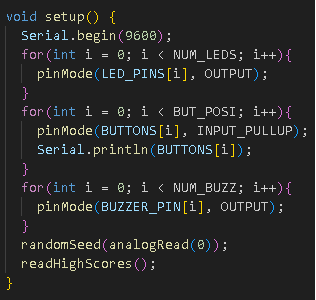

#### loop ( ) : void
Função padrão de loop do Arduino. Ela é executada continuamente, até que o Arduino seja desligado. 

No projeto, ela executa o jogo por meio de um switch case.

* START_GAME executa a função de inicialização do jogo.

* PLAY_LEVEL executa a função de execução dos níveis do jogo.

* GAME_OVER executa a função de fim de jogo.

* PLAY_AGAIN executa a funções de exibição dos resultados e de opção de reinicialização do jogo.

* END_GAME encerra o jogo, executando uma função nativa do Arduino que destiva o monitor serial. Caso você esteja jogando pelo Arduino físico, está função não terá muito efeito, uma vez que ela não encerra o loop principal.

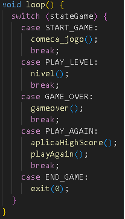

#### comeca_jogo ( ) : void
Essa função é responsável por iniciar o jogo. 

Ela chama a função [nivelDificuldade( )](#nivelDificuldade), que é responsável por definir a dificuldade do jogo. 

Após definida a dificuldade, uma validação é feita:

* Caso [stateGame](#stategame) == 5, o jogo irá executar o nível bônus. Após a execução, o [stateGame](#stategame) será alterado para PLAY_AGAIN.

* Caso contrário, o jogo irá alterar o [stateGame](#stategame) para PLAY_LEVEL e irá chamar a função [piscaTocaLed](#piscatocaled) para tocar uma sequência de inicio de jogo.

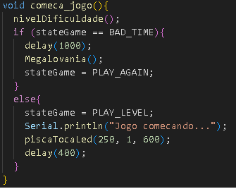

#### defineDificuldade ( ) : void
Essa função possui o template do menu de dificuldade.

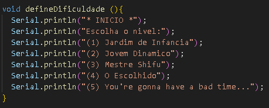

#### nivelDificuldade ( ) : void 
Essa função é responsável por definir a dificuldade do jogo, e por consequência, o tempo de apresentação da sequência de cores. 

Nela, é chamada a função [templateDificuldade( )](#templateDificuldade), que é responsável por exibir o menu de dificuldade. 

Além disso, ela é responsável por atualizar a variável [tempoPisca](#tempoPisca), que define o tempo de apresentação da sequência de cores.

Há 5 opções de dificuldade, sendo elas:
* Jardim de Infância (Fácil) - 0.7s

* Jovem Dinâmico (Médio) - 0.5s

* Mestre Shifu (Difícil) - 0.250s

* O Escolhido (Extremo) - 0.125s

* You're gonna have a bad time... - Nível Bônus

Caso o jogador não escolha a dificuldade, o jogo irá executar a dificuldade 11 

A nova dificuldade é armazenada na variável [stateGame](#stategame).

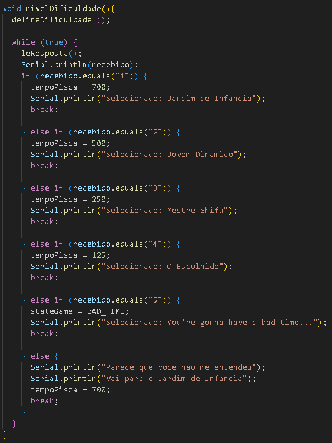

#### piscaTocaLed ( int : tempo, int : vezes, int : frequencia ) : void 
Essa função é responsável por piscar os LED's e tocar o buzzer principal N vezes. 

O parâmetro "tempo", define o tempo em que o LED fica ligado, o parâmetro "vezes" define quantas vezes o LED irá piscar, e o parâmetro "frequencia" define a frequência do som do LED.

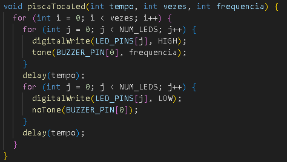

#### toqueGenerico ( int : ledId, int : buzzer, int : frequencia, int : tempo ) : void
Esta função é responsável por tocar um LED e um buzzer específico, de acordo com os parâmetros informados.

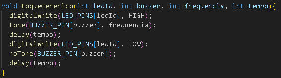

#### nivel ( ) : void
Esta função é responsável por executar o nível atual do jogo. 

Nela, é chamada a função [geraSequencia( )](#geraSequencia), que é responsável por gerar uma sequência de cores aleatórias. 

Em seguida, o jogo espera uma resposta do jogador. Caso a resposta eseja correta, o jogo irá chamar a função [vitoria( )](#vitoria), caso contrário, o jogo irá chamar a função [derrota( )](#derrota).

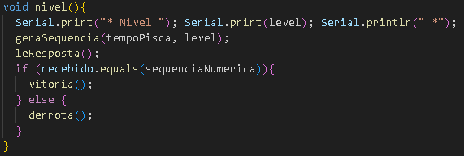

#### geraSequencia ( int : tempo, int : numLEDs ) : void
Essa função é responsável por gerar uma sequência de cores aleatórias. 

Além disso, ela deve atualizar a variável [sequenciaNumerica](#sequenciaNumerica) para a nova sequência de cores. 

O parâmetro "tempo" define o tempo em que o LED fica ligado, e o parâmetro "numLEDs" define o número de LED's que devem ser gerados.

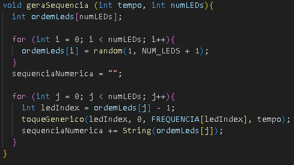

#### leResposta ( ) : void 
Esta função é responsável por ler a resposta do jogador, seja ela pelo monitor serial ou pelos botões. 

A resposta é aramazenada na variável [recebido](#recebido). 

Ela também é responsável por verificar se o jogador está AFK, permitindo que o jogador responda dento do tempo limite. 

A ordem de prioridade de verificação de resposta é:
Serial, Botões. 

Além disso, a resposta dos botões só é computada quando o número de botões pressionados for igual ao nível atual do jogo.

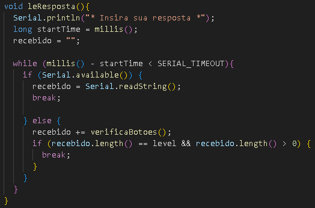

#### verifcaBotoes ( ) : String || return = String : sequencia
Esta funcão é responsável por verificar se os botões foram pressionados, e caso tenham sido, ela retorna o valor do botão pressionado no formato de String. Além disso, quando um botão é pressionado, seu respectivo LED e som são tocados 

É importante salientar que, por não haver um quinto LED, o quinto botão utiliza o 3º LED.

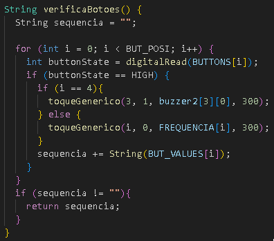

#### vitoria ( ) : void
Esta função é responsável por executar as ações de vitória do jogador. 

Ao chama-la, o jogo irá tocar o som de vitória, e irá atualizar o nível do jogo.

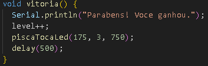

#### derrota ( ) : void
Esta função é responsável por executar as ações de derrota do jogador. 

Ao chama-la, o jogo irá tocar o som de derrota, e irá atualizar o estado do jogo para GAME_OVER.

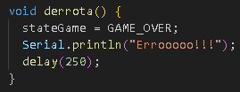

#### gameover ( ) : void
Esta função é responsável por executar as ações de fim de jogo. 

Ao chama-la, o jogo irá tocar o som de fim de jogo, e irá atualizar o estado do jogo para PLAY_AGAIN.

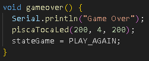

#### playAgain ( ) : void
Esta função é responsável por executar a exibição da opção de reinicialização do jogo. 

Ao chama-la, o jogo irá exibir ao jogador a possibilidade de jogar novamente. 

Em caso positivo, será chamada a função [restart( )](#restart), caso contrário, será chamada a função [end( )](#end).

#### restart ( ) : void
Esta função é responsável por reiniciar o jogo. 

Ao chama-la, o jogo irá atualizar o estado do jogo para START_GAME e o nivel para 1.

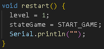

#### end ( ) : void
Esta função é responsável por encerrar o jogo. 

Ao chama-la, o jogo irá atualizar o estado do jogo para END_GAME e tocar a sequencia de encerramento.

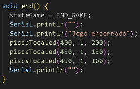

#### aplicarHighScore ( ) : void
Esta função é responsável por aplicar o highscore do jogador. 

Ao chama-la, o jogo irá atualizar a variável highScore. Para detereminar a pontuação do jogador. Após isso, o jogo irá chamar as função [sortHighScores( )](#sortHighScores), [writeHighScores( )](#writeHighScores) e [displayHighScores( )](#displayHighScores), nessa ordem.

Na versão do TinkerCad, a função [writeHighScores( )](#writeHighScores) não é chamada, uma vez que não é possível armazenar dados na memória EEPROM.

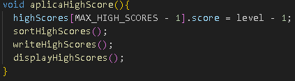

#### sortHighScores ( ) : void
Esta função é responsável por ordenar os highscores. 

Ao chama-la, o jogo irá ordenar os highscores, do maior para o menor, utilizando o algoritmo de ordenação Bubble Sort.

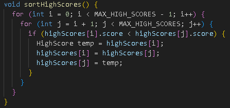

#### displayHighScores ( ) : void
Esta função é responsável por exibir os highscores.

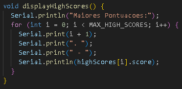

#### writeHighScores ( ) : void
Esta função é responsável por escrever os highscores na memória EEPROM. 

Exclusivo da versão do Arduino, uma vez que não é possível armazenar dados na memória EEPROM no TinkerCad.

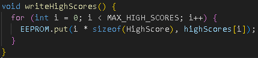

#### readHighScores ( ) : void
Esta função é responsável por ler os highscores da memória EEPROM. 

Exclusivo da versão do Arduino, uma vez que não é possível armazenar dados na memória EEPROM no TinkerCad.

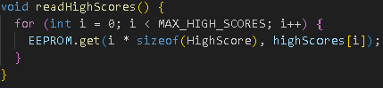

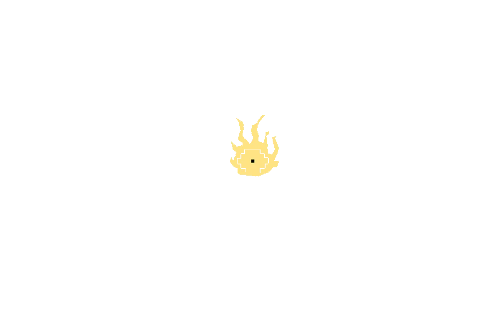
 

#### megalovania ( ) : void
Esta função é responsável por tocar a música Megalovania, do jogo Undertale, no nível bônus. 

Nela, são chamadas as funções [apresentacao()](#apresentacao), [ciclo1()](#ciclo1), [ciclo2()](#ciclo2), [ciclo3()](#ciclo3), nessa ordem.

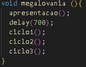

#### apresentacao ( ) : void
Esta função é responsável por exibir a mensagem de um certo amigo...

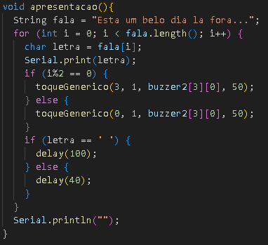

#### ciclo1 ( ) : void
Esta função é responsável por executar o primeiro ciclo da música Megalovania.

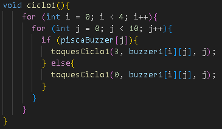

#### ciclo2 ( ) : void
Esta função é responsável por executar o segundo ciclo da música Megalovania.

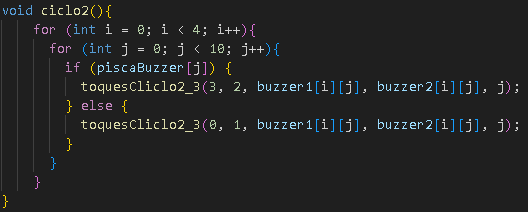

#### ciclo3 ( ) : void
Esta função é responsável por executar o terceiro ciclo da música Megalovania.

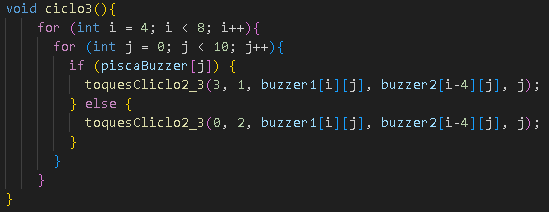

#### toquesCiclo1 ( ) : void
Esta função é responsável por executar os toques do primeiro ciclo da música Megalovania.

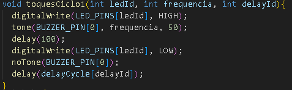

#### toquesCiclo2_3 ( ) : void
Esta função é responsável por executar os toques do segundo e terceiro ciclo da música Megalovania.

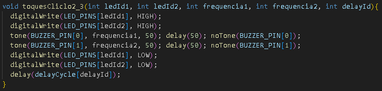

 

## Tecnologias 🛠️
* Ferramentas utilizadas para este projeto:
    - [Ardiuno](https://www.arduino.cc/en/software)
    - [Tikercard](https://www.tinkercad.com)

### Last update
* 19/09/2023

## Contatos
Desenvolvido por Mateus Leme

### LinkedIn
*  <a href="https://www.linkedin.com/in/mateus-da-costa-leme-35a5ab235/">Mateus da Costa Leme</a>

### Email
*  mateusdacostaleme@gmail.com

